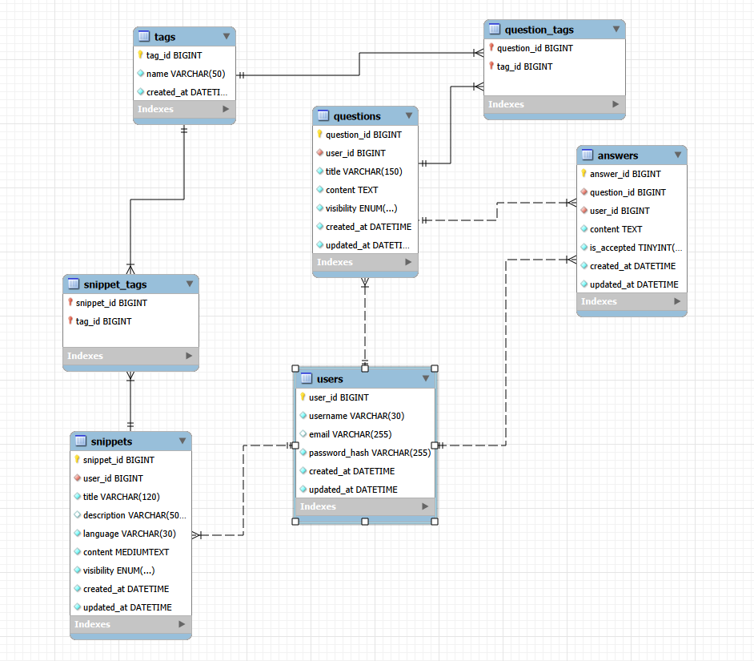

# DevHub

개발 중 마주친 문제 해결 과정과 코드 스니펫을 기록하는 **개발자 개인 지식 저장소 플랫폼** 입니다.

StackOverflow 스타일의 질문/답변 구조와  코드 스니펫 관리 기능을 결합하여,  
개발 경험을 체계적으로 기록하고 검색할 수 있도록 설계했습니다.

---

## 🛠 Tech Stack

### Backend
- Java
- Spring Boot
- Spring Data JPA
- Gradle
- MySQL

### Frontend
- Next.js
- React
- TypeScript
- Tailwind CSS

### 기타
- React Syntax Highlighter (코드 하이라이팅)

---

## 🏗 Architecture

```
[ Next.js (Frontend) ]

    │
    ▼

[ Spring Boot API ]

    │
    ▼

[ JPA / Hibernate ]

    │
    ▼

[ MySQL ]
```
---

## ✨ 주요 기능

### Knowledge Archive (문제 해결 기록)

개발 중 마주친 문제와 해결 과정을 기록하는 기능

- 질문 작성
- 질문 목록 조회
- 질문 상세 조회
- 질문 삭제
- 답변 작성
- 답변 삭제
- 답변 채택 기능

---

### Code Snippets

자주 사용하는 코드 조각을 저장하는 기능

- 스니펫 작성
- 스니펫 목록 조회
- 스니펫 상세 조회
- 스니펫 삭제
- 코드 하이라이팅 지원

---

### Tag System

질문과 스니펫을 태그 기반으로 분류

- 태그 등록
- 태그 기반 검색
- 태그 클릭 조회

예시

    #spring
    #security
    #java
    #jwt

---

### 🔎 Search

키워드 기반 검색 기능

- 질문 검색
- 스니펫 검색
- 태그 검색

예시

    /questions/search?keyword=security
    /snippets/search?tag=java

---

## 📂 Project Structure

    devhub
    ├── backend
    │   └── devhub-api
    │       ├── controller
    │       ├── service
    │       ├── repository
    │       ├── dto
    │       └── entity
    │
    ├── frontend
    │   └── devhub-front
    │       ├── app
    │       ├── components
    │       ├── lib
    │       └── styles
    │
    └── README.md

---

## 🗄 Database Design



### 주요 테이블

- users
- questions
- answers
- snippets
- tags
- question_tags
- snippet_tags

---

## ⭐ Features Highlight

### 답변 채택 기능

여러 해결 방법 중 가장 유용한 답변을 채택하여  
다음에 참고할 때 **권장 해결 방법을 빠르게 확인할 수 있도록 설계했습니다.**

---

### 코드 하이라이팅

코드 스니펫에서 **Syntax Highlighting**을 지원하여  
코드 가독성을 높였습니다.

---

### 태그 기반 탐색

태그 클릭 시 해당 태그의 글을 바로 조회할 수 있도록 구현했습니다.

---

## 🚀 향후 개선 예정

- 스니펫 공개 범위 관리
- 페이지네이션 개선
- Docker 기반 배포
- 검색 기능 고도화

---

## 👨‍💻 Author

개인 개발 프로젝트  
개발 과정에서 발생한 문제 해결 경험과 코드 스니펫을 체계적으로 관리하기 위해 제작했습니다.